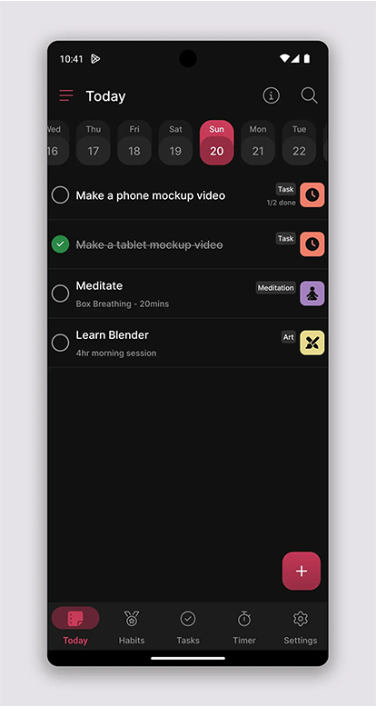
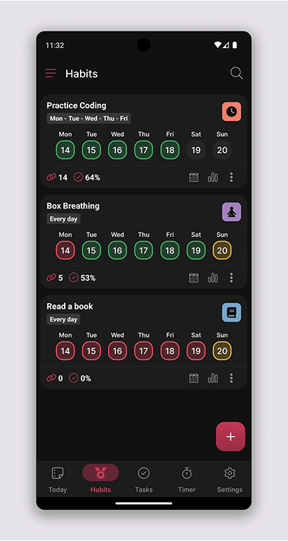
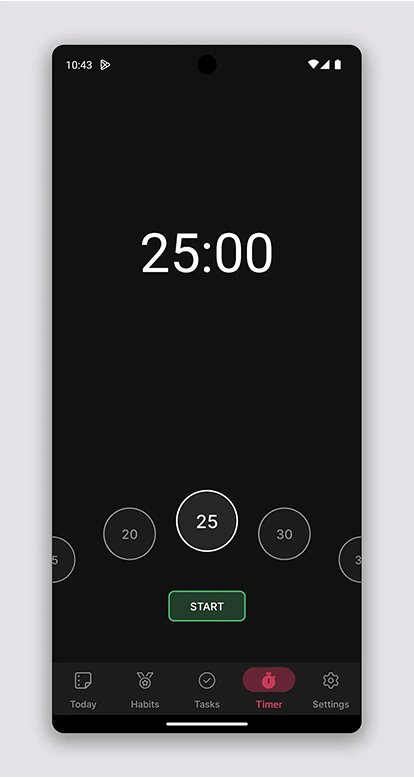

# FocusForge: Productivity Mobile App

**FocusForge** is a productivity mobile app designed to help users build habits, manage tasks, and stay focused through a customizable Pomodoro timer. Built with React Native, empowering users to boost their productivity with features like habit tracking, task management, and streak analytics.

This repository contains the full source code for FocusForge, currently set up for local development and testing via Expo. Run it on a physical device or emulator to explore its capabilities.

---

## 🌟 Features

- **Habit Tracking**: Create and monitor habits with streak counters, completion metrics, and visual feedback.
- **Task Management**: Organize single or recurring tasks with checklists, due dates, and priority levels.
- **Pomodoro Timer**: Customizable focus sessions (5-60 minutes) with vibration alerts to enhance productivity.
- **Statistics Dashboard**: View habit performance with graphs, pie charts, and streak challenges for motivation.
- **Personalization**: Customize your profile with a photo and toggle settings like dark mode (in development).
- **Search & Filter**: Easily find tasks or habits with a dynamic search bar across screens.

---

## 🛠️ Technologies

- **Framework**: React Native, Expo
- **State Management**: Zustand
- **Backend**: Firebase (authentication, database)
- **UI Components**: Tamagui, React Native Reanimated
- **Data Visualization**: Victory Native
- **Tools**: Android Studio (for emulation)

---

## 🚀 Getting Started

Since FocusForge isn’t available on the Play Store or App Store, you’ll need to run it locally on a physical device or an emulated Android phone (as used during development). Follow these steps to set up and explore the app:

### Prerequisites

- **Node.js** (v18 or later)
- **Expo CLI** (install globally with `npm install -g expo-cli`)
- **Android Studio** (for Android emulation)
- **Physical Device** (optional, with Expo Go app installed)

### Setup Instructions

1. **Clone the Repository**

   ```bash
   git clone https://github.com/jtakaendisa/focusforge-productivity-mobile-app.git
   cd focusforge-productivity-mobile-app
   ```

2. **Install Dependencies**

   ```bash
   npm install
   ```

3. **Configure Environment Variables**

   - Create a `.env` file in the root directory.
   - Copy the variables from `.env.example` and fill in your Firebase credentials.

4. **Start the Expo Server**

   - Run the app with Expo:
     ```bash
     npx expo start
     ```
   - This opens the Expo developer tools in your browser.

5. **Run on Emulator or Device**
   - **Android Emulator** (via Android Studio):
     - Ensure an Android Virtual Device (AVD) is set up.
     - Press `a` in the terminal to run on Android.
   - **Physical Device**:
     - Install the Expo Go app on your device.
     - Scan the QR code from the Expo developer tools.

---

## 📖 Usage

- **Sign Up/Login**: Use Firebase authentication to create an account or log in.
- **Create Habits/Tasks**: Add habits or tasks with details like frequency, due dates, and categories.
- **Track Progress**: Monitor streaks and completion rates on the Statistics tab.
- **Use Pomodoro Timer**: Set focus sessions to stay productive.
- **Customize Profile**: Upload a profile picture and adjust settings (e.g., dark mode).

---

## 📸 Screenshots

### Home Screen

  
The central hub for productivity, featuring a calendar carousel and a filtered task/habit list. Built with React Native and `react-native-calendars`, it offers intuitive navigation and a consistent UI across platforms using Tamagui.

### Habits Screen

  
Displays a list of habits with streak lengths, completion percentages, and interactive date cards. Powered by `react-native-reanimated` for smooth animations, it motivates users with real-time visual feedback.

### Timer Screen

  
Offers a customizable Pomodoro timer (5-60 minutes) with animated controls via `react-native-reanimated`. Vibration alerts signal session completion, enhancing focus and productivity.

### Habit Details - Statistics Tab

  
Provides in-depth habit analytics with graphs and a success/failure pie chart using `victory-native`. It transforms data into actionable insights, driving user engagement and growth.
